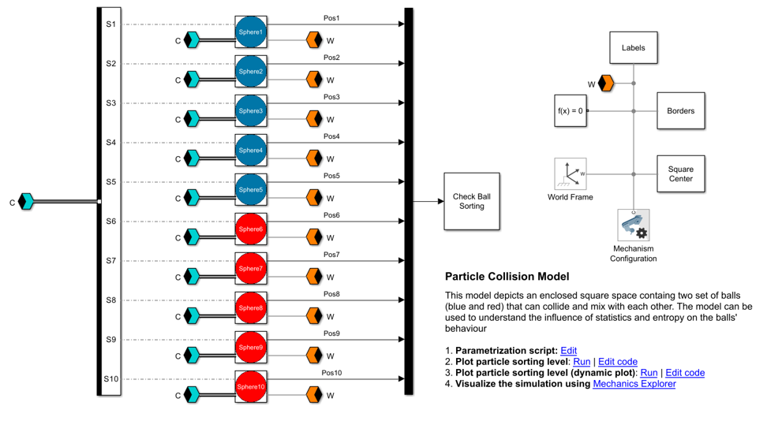
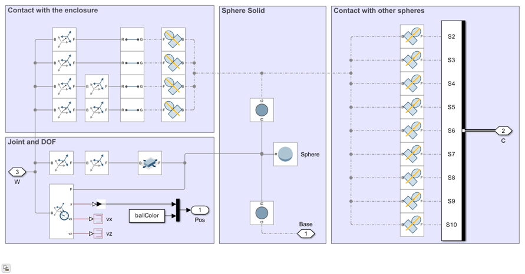
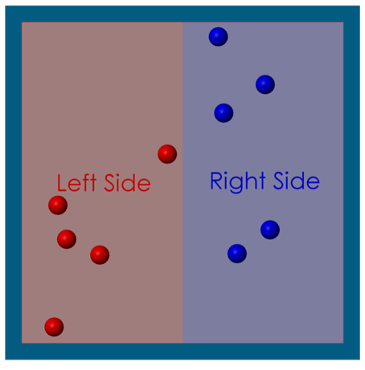
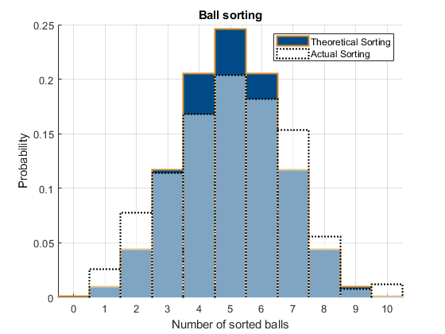

## Model Particle Collision with Simscape Multibody
The model simulates the behavior of 10 spheres (five red and five blue). The spheres represent particles of two different gases and are placed within a square enclosure. The particles are free to move within the enclosure, collide with one another, and bounce off the enclosure's boundaries. Initially, all red particles are on the left side of the enclosure while all blue particles are on the right side, as illustrated below. When the simulation begins, each particle is imparted with an identical amount of energy, initiating their movement. Over time, due to collisions and their movements, the particles will eventually mix together completely.

This model serves as a practical demonstration of entropy, illustrating the natural tendency for the particles to mix, driven by their interactions and movements

**Disclaimer**: This model has been inspired [this video](https://www.youtube.com/watch?v=VCXqELB3UPg&t=785s&ab_channel=AlphaPhoenix) posted on the youtube channel AlphaPhoenix on the 24.05.2024. We advise to check out the video for more information on entropy and how it works. 

## Model Overview
Each particle is modeled with a subsystem reference. Their contact ports are grouped together in the connection label C (blue label). This connection label is used to model the contact interactions between the particles. A MATLAB Function block monitors the position of the particles over time and calculates how they are sorted within the enclosure.

### Parametrization
The model is parametrized with the script [entropyModelParam.mlx](scripts/entropyModelParam.mlx). In the script you can change the dimensions of the enclosure, the mass of the particle, and their initial energy. Changing these parameters will impact the number of collisions. For example, if the radius of the particles increases, but the enclosure dimensions remain the same, the probability of a collision will increase. The higher the number of collision the higher the computational time required by the solver.

For the positioning of the spheres, the script calls [sortBallsWithinRange.m](scripts/sortBallsWithinRange.m) twice. This function is used to position the spheres into the enclosure while ensuring that the spheres do not collide with each other or with the enclosure. In the current settings, the function also ensure that at the start there are five red spheres on the left side and five blue spheres on the right side.

entropyModelParam.mlx also calculates the initial speed of each sphere. It is assumed, that all spheres have the exact same energy at the start (the value can be tuned by the user) so that the script calculates (through the particle's mass) the corresponding speed. The speed is then combined with a random angle so that the speed vector of each particle points in a different direction.

### Particle and contact model
The particles are modeled with the subsystem [sphereModel.slx](model/sphereModel.slx). Regardless their color all particles have the same mass and dimensions (though these parameters can be adjusted in the subsystem mask). A rectangular joint allows the particles to freely translate within the enclosure. Interactions with the enclosure walls are simulated using a line contact block. Each particle is connected with 9 planar contact blocks with the other nine particles. Within the subsystem mask, users assign a unique identifier ranging from 1 to 10 to each particle. This identifier determines the appropriate contact port connections via the bus selector. For instance, a particle designated as number 1 will be configured to interact with particles numbered 2 through 10. Conversely, if a particle is assigned the number 10, it is set to interact with particles 1 through 9.

All contacts are frictionless and perfectly elastic (no energy loss through damping). The particles can move along the horizontal and vertical direction (2D movement) within the enclosure, but cannot rotate (due to the rectangular joint that allows only for tow degrees of freedom). This assumption is consistent with the fact that there is no friction occurring during the contact and the resulting contact forces are always acting towards the center of the particle and cannot build any torque.

The impact of gravity on the particle is neglected, as the gravitational acceleration is set to zero

### Contact Model
A MATLAB Function Block tracks the particles' position at a fixed timestep. The function assesses the level of "mixing" of the particles. The degree of mixing / sorting can be quantified in various ways; in this example, it is represented with a "sorting level". The sorting level is an integer value ranging from 0 to 10. Each particle contributes to the sorting level depending on its position and color:
- A red particle positioned on the left side (the designated red side) of the enclosure earns a score of 1; if it's on the opposite side, it scores 0.
- A blue particle earns a score of 1 if it's on the right side (the designated blue side) of the enclosure; otherwise, its score is 0.

In the scenario shown below, the particles are in a state of perfect sorting, with all red particles on the left and all blue particles on the right, resulting in an initial sorting level of 10. It's important to note that if all blue particles were on the left and all red particles were on the right, the sorting level would be 0. Although the particles are technically sorted in this scenario, they are arranged contrary to the predefined convention of this example, hence the score of 0. Once the simulation is started, the particles start moving and their sorting level changes.

As energy is not taken away from the system, the particle will keep moving, never reaching a stationary sorting level. Notably, the sorting level will, for the most part, stabilize around 5. This sorting level is the statistically most probable configuration and - at the same time - also the system's configuration with the highest entropy. Thus, without the introduction of additional energy into the system, it naturally evolves towards a state of maximum entropy, validating the principle that systems tend to move towards higher entropy states when left undisturbed.

## Visuals: Analyze particle sorting over time
After simulating the model, you can analyze the particles' sorting with the function [plotBallSorting.m](scripts/plotBallSorting.m). The resulting plot (shown below) has two histograms.

The blue histogram represents the theoretical distribution obtained if we were to calculate all possible configurations (for 10 spheres we have 2^10 possible configuration) and derive their sorting level. We see that the probability of achieving a sorting level of 0 and 10 is extremely low. In fact, both probabilities are the same as there is only one configuration out of 1024 where the sorting level is 0 (all red balls on the right and all blue balls on the left) and only 1 configuration where the level is 10 (all blue balls on the right and all red balls on the left). The histogram is perfectly symmetrical, reflecting the equal likelihood of "mirrored" sorting levels. For instance, the probability of encountering a sorting level of 1 is the same as that for a sorting level of 9, illustrating the paired nature of sorting probabilities (e.g., the number of configurations leading to a sorting level of 2 and 9 is the same: 10). Please note that the blue histogram has calculated with purely statistical method and did not require any simulation of the model.

The white histogram represents the distribution of the particle as obtained from the simulation. Every 1 seconds the position of the particle is analyzed and the sorting level derived. The result is the white histogram. If we simulate long enough and allow for enough collisions to occur, the white histogram will come closer and closer to the blue one.

The similarity between the two histogram depends on the number of collisions. Specifically, conducting the simulation over an extended period results in an increased number of collisions, which, in turn, causes the experimental distribution of sorting levels to more closely align with the theoretical distribution. The histograms depicted below show that the system naturally gravitates towards the configuration of highest probability (5) and consequently, highest entropy. This phenomenon is consistently observed given sufficient simulation time, thereby corroborating the second law of thermodynamics.

## Installation
This model was built in MATLAB&reg; R2024a and requires the following products:
- MATLAB&reg;
- Simulink&reg;
- Simscape&trade;
- Simscape&trade; Multibody&trade;

## Authors and acknowledgment
- Lorenzo Nicoletti, [LinkedIn](https://www.linkedin.com/in/lorenzonicolettiphd/)
- Jan Janse van Rensburg
- Steve Miller
